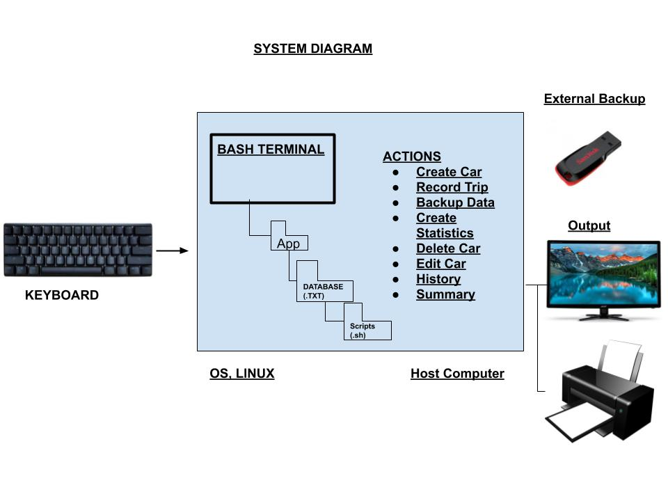

Car Rental Minimal App
===========================

A car rental management minimal app in Bash.

Contents
-----
  1. [Planning](#planning)
  1. [Design](#design)
  1. [Development](#development)
  1. [Evalution](#evaluation)

Planning
----------
**Defining the Problem (Topic 1.1.1)**
(100-150 words explaining the context of the problem)
The client kept all previous records offline and it proved inefficient. The client here wants to create a simple program so that he can simply keep tabs on his car rental business. He wants to keep his data organised to increase the efficiency, productivity and quality of his business. He does not want a complicated program because he doesn't know much about coding, and so he wants the program to be user skill independent.
<br> Steps to Create a car in a system: <br>
1. Get inputs (read/argument) (plates, model, color, passanger number)
2. Check number of arguments. if 4 then continue, if not exit "message"
3. Write to main file with one extra line. Not erasing other entries.
4. Create Car trip file with licenseplate .txt

### Rationale for proposed solution
The context
Old system
Problems
Motivation

### Success Criteria
This are measuarable outcomes
1. A car can be created and stored in the database
1. A car information can be edited
1. A car can be deleted from the database
1. The installation is ***simple -> one step process***
1. A summary (total/average distance traveked) can be generated for a particular car
1. Trips can be recorded and stored for an existing car.
1. A basic database system is implemented.
1. A basic backup functionality.


Design
---------
### First Sketch of the system


Development
--------
### The following script creates the app folder and inside it creates two more folders: db and sports
```.sh
#!/bin/bash

#THis file creates the folder strucutre for the
#minimal Car Rental App

echo "Starting the installation"
echo "Enter the path where you want to install. Press Enter"

read path

#moving to the desired location
cd $path
echo "moving to $path"
echo $PWD

#Check for correct change directory
if ( $path != $PWD ); then
        echo "Error creating the folder"
        exit
fi

#create app folder
mkdir RentalCarApp

cd RentalCarApp

#create folder for database and scripts
mkdir db
mkdir scripts

echo "Structure created successfully"
```
It first had an issue where it would work but show an error [to do] Fix the bug,
**Update:**
It has been fixed, there should have been squared brackets instead of normal brackets.

```.sh

#!/bin/bash

#THis file creates the folder strucutre for the
#minimal Car Rental App

echo "Starting the installation"

cd /Users/nabillnuqman/Desktop
#create app folder
mkdir RentalCarApp

cd RentalCarApp

#create folder for database and scripts
mkdir db
mkdir scripts

echo "Structure created successfully"
  echo "Do you want to keep the file? yes/no"
read option
if [ $option == "yes" ]; then
        echo "done"
fi

if [ $option == "no" ]; then
        cd /Users/nabillnuqman/Desktop
        rm -r RentalCarApp
fi
```
**UpdateV2:**
I have made a new program which instantly adds the folder into the desktop and gives the option to uninstall.

### The following script deletes the car files with just the use of the plate argument ###
```.sh

#!/bin/bash

if [ $# -eq 1 ]; then
                #open maincarfile.txt and delete one line
                #Mac sed requires a parameter after -i, so if you don't want a backup, you still have to add an empty string
        sed -i '' "/$1/d" db/maincarfile.txt
                #now we are entering the db file to remove the plate file
        cd ~/Desktop/RentalCarApp/db
        rm  $1.txt
else
        echo "invalid input"
fi
```
This program asks the user for the license plate of a specific car and with that information the program will search for the plate no in the maincarfile and delete all the car information and will delete the specific car file.

### The following script summarises the car information, specifically kilometers ###
```.sh
#!/bin/bash

if [ $# -ne 1 ]; then
  echo "invalid input, please enter license plate"
  exit
fi
```
**This code, checks if the user enters the correct input, if it doesn't, the program exits and asks the user to enter the correct input**

```.sh
cd ../db/
FILE=$1
if [ ! -f "$1.txt" ]; then
  echo "File $FILE does not exist."
  exit
fi
```
**This code checks if the input enters matches with an existing file, cd ../db/ is used because the summarise file is inside the scripts file so it needs to exit the script folder and enter the database folder to check if the file exists**

```.sh
total=0
while read line;
do
    for km in $line
    do
      (( total=$total+$km ))
      break
    done
  done < "$FILE.txt"
#show results nicely
  echo "Total kilometer of the group is $total"
  exit
```
**The Following script creates a car and record trip info**

```.sh
!/bin/bash

#this file is used to create a car and record trip info

#number of arguments is incorrect, then exit
if [ $# -ne 4 ]; then
        Echo "Invalid Input, please enter Plate, Model, Color, and number of passengers"
        exit
fi

#number of arguments is correct. Continue

plate=$1
model=$2
color=$3
pp=$4

#adding new entry to file maincarfile.txt
echo "$plate $model $color $pp" >> ~/Desktop/RentalCarApp/db/maincarfile.txt
echo "" > db/$plate.txt

bash frame.sh "Car created successfully"
```
This Program allows the user to create a car, the user inputs the car info then the program moves that information into the maincarfile and creates a specific file for the specific car.

**The following script is used to record the trip information about a car**

```.sh
#!/bin/bash

#This file is used to record trip information of a car

if [ $# -ne 4 ]; then
        Echo "Invalid Input, please enter Plate, km, DateOut, and date in"
        exit
fi

#number of arguments is correct. Continue

plate=$1
km=$2
dateout=$3
datein=$4

if [ ! -f "$plate.txt"]; then
echo "Car exists"
fi

echo "$plate $km $dateout $datein" >> ~/Desktop/RentalCarApp/$plate.txt
```
The program allows the user to input car information and the program will move the information into the specific car file.

**The following script allows the user to edit a car information, the user enters the plate number and new information that is wanted to be placed instead**

```.sh
#!/bin/bash
#This program edit the information of an exiting car in the
#maincarfile
#user enters [license place] [model] [red] [pp]

if [ $# -ne 4 ]; then
  echo "Error with the number of arguments"
  echo "Enter License Maker Model Passengers"
  exit
fi

license=$1
maker=$2
model=$3
pp=$4


if [ ! -f "$license.txt" ]; then
  echo "File not found!"
fi
cd db
#find the line with the given car plate and delete it
sed -i '' "/^$license/d" maincarfile.txt
#add the new information
echo "$license $maker $model $pp" >> maincarfile.txt
cd ..
bash frame.sh "Car edited successfully"
```
So all the user has to do is input the desired car plate no of the car the user wishes to change, along with the new information that is wanted. The program locates the file using the plate no and reads it and deletes the line and adds the new car information that was inputted by the user.

**The following script backups the database folder into the Desktop**

```.sh
#!/bin/bash

#This program makes a copy of the the database file into the desktop

cp -r ~/Desktop/RentalCarApp/db ~/Desktop
```
**The following script allows the user uninstall the whole Car Rental App program by deleting everything**
```.sh
#!/bin/bash

#This file uninstalls RentalCarApp by deleting all folders

        echo "Are you sure you want to uninstall RentalCarApp?"
        echo "Click enter to uninstall, Click n to go back"

read back

if [[ ($back == n) ]];then
        echo "Uninstall cancelled"
exit

else
        cd ~/Desktop
        rm -r RentalCarApp
        echo "RentalCarApp succesfully uninstalled"
fi
```

Evaluation
-----------
Test 1:


step 1: create a car using the script create


step 2: check that the license file .txt was created


step 3: Check that the car was added to the main file

The first run of the test was unsuccessful because the database folder was nonexistent, The create program did not save the plate file inside the database. To solve that, the line `echo "" > $plate.txt` to `echo > db/$plate.txt` was changed.

Second run realised that the test file needed to move to the main folder
```
cd ../
```
This is necessary because create.sh is in the main folder whereas the test file is in the /tests folder.

We used the command tail to check if the car exists in the maincarfile.
```
lastline = $( tail -n 1 db/maincarfile.txt )
```
using tail, it reads the textfile from bottom up and we use -n 1 to read the first line.

we added and if command, to check if it exist
```
if [ "TXM301 nissan red 9" == "$lastline" ];then
        echo "test two: Record was entered correctly: passed"
else
        echo "Test two: Failed"
fi
```
Quotation marks are used for lastline are used so that the word stays as a word, with quotation marks, the program will recognizes the spaces and count it as different words.

**Summary:**
We ran Dynamic tests, Alpha tests, and Whitebox tests. Dynamic tests are actually executing the code made. Alpha testing performed by testers who are usuallyinternal employees of the organization. White-box testing (also known as structural testing) looks inside the software that is being tested and uses that knowledge as part of the testing process. Whitebox testing looks inside the software that is being tested and uses that knowledge as part of the testing process.
